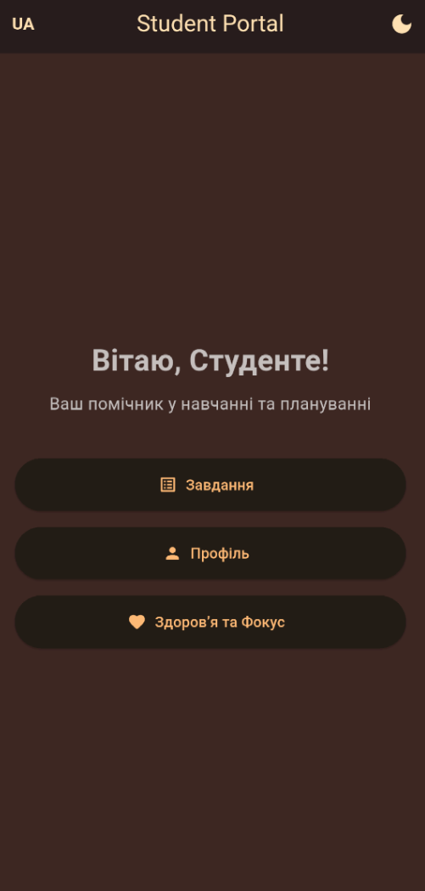
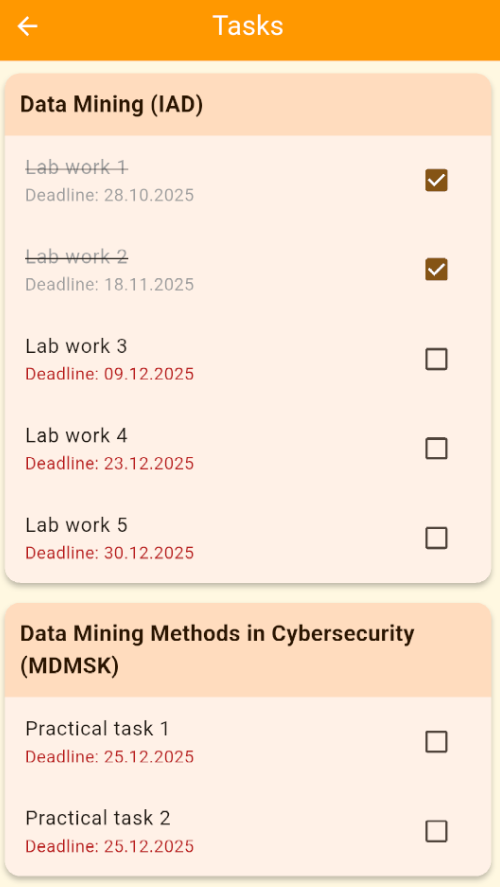
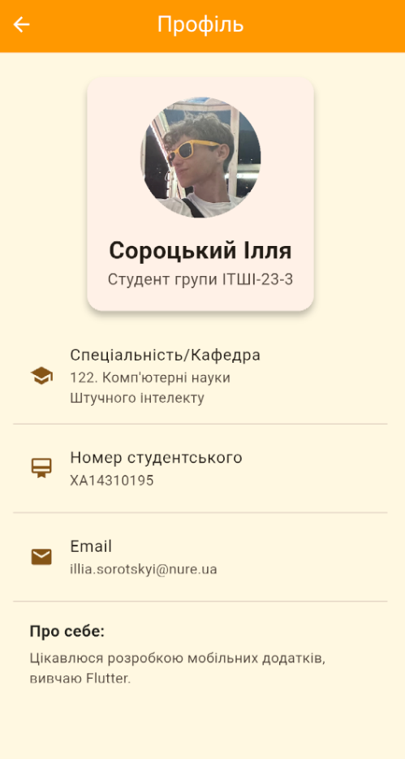
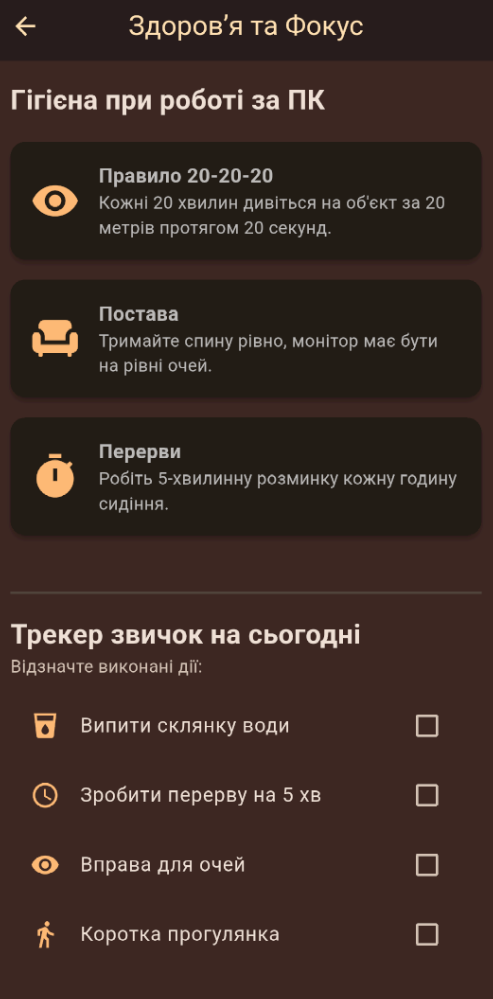

# Student Portal App

Мобільний додаток для студентів, розроблений на Flutter. Допомагає організувати навчальний процес, слідкувати за дедлайнами та підтримувати корисні звички.

## Функціонал
- **Профіль:** Перегляд даних студента (група, спеціальність).
- **Дедлайни:** Список завдань з прив'язкою до предметів.
- **Здоров'я:** Трекер води та перерв для очей.
- **Налаштування:** Темна тема та зміна мови (UA/EN).

## Скріншоти
<p float="left">
  
   
  
  
</p>

## Встановлення
1. Клонуйте репозиторій:
   ```bash
   git clone https://github.com/illiasor/MIST_StudentPortal.git
2. Відкрийте проєкт у VS Code або Android Studio.
3. Запустіть команду flutter pub get.
4. Запустіть додаток на емуляторі.